# Agent 基础知识

如果你用 Cursor 写过代码，看它搜索代码库、编辑文件、运行测试直到通过；用 Deep Research 调研过课题，看它反复搜索、阅读并整理出报告；用 Manus 操作浏览器完成在线任务；让豆包手机助手帮你订票、发消息；或者让 Pine AI 替你打电话与运营商协商账单——那么，你已经接触过 AI Agent。

这些产品形态各异，但本质上属于同一类系统：它们不再只是“你问一句，它答一句”的聊天机器人，而是能够理解目标、规划步骤、调用工具，并根据执行结果不断调整行动的智能系统。

AI Agent 正在改变人与计算机的交互方式。过去，我们需要自己拆解任务、打开软件、点击按钮、复制信息；现在，越来越多任务可以交给 Agent，让它在目标约束下自主完成。

本章将从实践出发，建立理解 AI Agent 的基础框架。我们会先拆解 Agent 的核心组成，再观察它如何通过 ReAct 循环完成任务，然后引入 Harness 工程，理解一个 Agent 如何从能跑的 Demo 走向可靠的生产系统，最后梳理构建 Agent 时必须回答的关键问题：设计原则、模型选型、编排模式、框架选择以及护栏与人工干预。

> 阅读提示
>
> 本章是全书的概念地图。它会快速引入 Agent 的核心公式、运行循环、工程框架和设计模式，为后续章节提供统一的术语和参照。初次阅读时不必记住所有细节，只需建立整体印象；后续章节会逐步展开这些概念，读者可以随时回到本章对照。

## 现代 Agent = LLM + 上下文 + 工具

引言已经给出了现代 Agent 系统的核心公式：

> Agent = LLM + 上下文 + 工具

用更直观的说法，就是“大脑 + 眼睛 + 手脚”（如引言图0-1所示）：LLM 作为大脑，负责理解意图、规划步骤和做出判断；上下文作为眼睛，提供决策所需的全部信息，包括环境状态、用户记忆、领域知识、任务进展和历史交互记录；工具作为手脚，负责执行行动并影响外部世界——凡是能够让 Agent 与外部世界交互的能力，都属于广义上的工具。

需要提醒的是，“眼睛”只是一个粗略的类比：上下文中不仅包含环境信息和对话历史，还包含工具定义——也就是说，Agent “看到”的信息中也包括了“有哪些手脚可用”。本章后文讨论上下文的组成时会再次看到这一点：工具定义本身就是上下文的一部分。

这三个组成部分恰好对应强化学习（RL，详见第七章）中的三个核心概念。表1-1是可选阅读——如果你没有 RL 背景，完全可以跳过，不影响后续理解；它主要帮助有 RL 背景的读者将已有知识与本书术语对应起来。

**表1-1 Agent 三要素与强化学习概念的对应关系**

| 直觉理解 | 实现组件 | 学术概念                          | 含义                                                         |
| -------- | -------- | --------------------------------- | ------------------------------------------------------------ |
| **大脑** | LLM      | **策略**（policy）                | Agent 决定“下一步做什么”的决策逻辑——面对当前看到的信息，从所有可选行动中挑出最合适的一个 |
| **眼睛** | 上下文   | **观察空间**（observation space） | Agent 能看到的所有信息——能看到什么、读到什么、记住什么、能访问哪些系统 |
| **手脚** | 工具     | **动作空间**（action space）      | Agent 能做的所有事情的集合——有哪些“手段”可用，从发消息到执行代码再到操控界面 |

对这张表需要补充两点。严格地说，某一时刻的上下文只是观察（observation）的一个实例，观察空间才是所有可能观察的集合，表中取的是“空间”层面的对应。此外，RL 还有一个核心概念——奖励（Reward），本表没有列出，第七章讲后训练时会用到它。

理解这三者的作用及其相互关系，是构建 Agent 系统的基础。下面先看看不同类型的 Agent 如何在这三个维度上展开，如表1-2所示。

**表1-2 典型 Agent 产品的三要素拆解**

| Agent 产品                          | 眼睛（感知）                         | 手脚（行动）                                           | 大脑（策略）                                                 |
| ----------------------------------- | ------------------------------------ | ------------------------------------------------------ | ------------------------------------------------------------ |
| **Cursor 等 Coding Agent**          | 需求文档、代码库、终端环境           | 开放式（内部思考、代码搜索、文件读写、执行命令等）     | 以测试通过为终止条件的增量式试错决策：每次编辑后运行测试，根据失败信息决定下一步修改 |
| **Deep Research 等搜索 Agent**      | 网络资源、学术数据库、本地文件       | 开放式（内部思考、搜索查询、网页阅读、摘要生成）       | 以信息充分为终止条件的迭代深化决策：根据已有信息判断缺口，动态调整搜索方向 |
| **Manus 等电脑操控 Agent**          | 电脑屏幕、浏览器页面、文件系统       | 开放式（内部思考、点击、输入、滚动、截图、执行代码等） | 以屏幕反馈为依据的观察—操作—验证决策：每步操作后重新观察屏幕，确认效果再继续 |
| **豆包等手机助手 Agent**            | 手机屏幕、已安装的 App               | 开放式（内部思考、点击、滑动、输入、打开 App 等）      | 以用户意图达成为终止条件的界面操作决策：依据当前屏幕状态选择点击、滑动或输入 |
| **Pine AI 等个人办事 Agent**        | 用户账户信息、历史账单、服务商知识库 | 开放式（内部思考、打电话、发邮件、填表单、与用户确认） | 以协商目标达成为终止条件的多轮交涉决策：根据对方回应实时调整策略，必要时与用户确认 |

虽然这些 Agent 的应用场景不同，但都具备三个共同特征：

- 能思考：在行动前进行规划与决策；
- 能行动：通过工具影响外部世界；
- 能反馈迭代：根据环境反馈持续调整策略。

这些能力正是 LLM、上下文和工具协同作用的结果。

------

在三个组成部分中，工具最容易被直接观察到。下面先从“Agent 能做什么”开始，再回到模型如何决策、上下文如何支撑决策。

### 工具：Agent 的手脚

#### 定义

工具是 Agent 与外部世界交互的能力。

没有工具，Agent 只能生成内容；有了工具，它才能查询信息、执行操作并完成任务。从这个意义上说，工具相当于 Agent 的手脚。

#### 分类

为了系统化地讨论工具，可以根据 Agent 与外部世界交互的方式，将工具分为五类。

- 感知工具：帮助 Agent 获取信息，例如搜索引擎、文件系统、数据库和 API。
- 执行工具：帮助 Agent 改变外部世界，例如代码执行、系统命令、文件操作和外部 API 调用。
- 协作工具：帮助 Agent 与人类或其他 Agent 分工合作。
- 事件触发工具：通过邮件、定时任务、Webhook 等外部事件触发 Agent 开始执行任务。与前几类工具不同，它们的特殊之处在于“注册由 Agent 完成、触发由外部完成”：注册监听、设置定时的动作本身仍是 Agent 的主动调用，只是后续的触发来自外部输入，由外部事件驱动 Agent 启动工作流。第四章会展开这套完整机制。
- 用户沟通工具：帮助 Agent 主动向用户传递信息并进行交互，例如发送消息、邮件或发起语音通话。

以上五类工具的完整分类体系和设计原则将在第四章展开讨论。

工具设计的质量直接影响 Agent 的能力上限。接口定义不清晰，模型容易误用工具；权限控制不合理，错误会被放大；错误处理不完善，任务容易中途失败。MCP（Model Context Protocol，模型上下文协议）的推广正在降低工具接入成本，让工具更像可插拔组件；但无论工具生态如何变化，清晰、稳定、易组合的设计原则始终不会改变。

#### 工具调用

工具调用（Tool Calling，也称 Function Calling）是现代 Agent 的核心能力之一。

它让模型能够以结构化的方式调用外部工具，从而从“生成文本”扩展为“执行任务”。本书后续统一使用“工具调用”这一术语。

一次工具调用通常包含四个步骤：

1. 向模型声明可用工具；
2. 模型决定是否调用工具，以及调用哪个工具；
3. 工具执行并返回结果；
4. 模型根据结果决定下一步行动。

这个循环正是后文将介绍的 ReAct 的基础。

以天气查询为例，四步流程在 API 层面的简化表示如下。

第一步，声明工具：

```
tools: [{
  name: "get_weather",
  parameters: { city: "string" }
}]
```

第二步，模型决定调用：

```
assistant: {
  tool_calls: [{
    id: "call_1",
    function: "get_weather",
    arguments: { city: "北京" }
  }]
}
```

第三步，结果追加到上下文：

```
tool: {
  tool_call_id: "call_1",
  content: '{"temp":28,"sky":"晴"}'
}
```

第四步，模型基于结果回复：

```
assistant: {
  content: "北京今天 28°C，晴。"
}
```

开发者负责定义工具和执行工具调用；模型负责决定是否调用工具、调用哪个工具以及传递什么参数。

第二章将给出工具调用的完整规范示例，详细展开每个字段的结构和含义。

#### 工具设计

设计工具时，应优先提供通用能力，而不是大量专用能力。

例如，与其设计一个计算器工具，不如提供 Python 代码解释器；与其设计一个记录工作日志的工具，不如提供文件读写能力和文件系统。

通用工具更容易组合，也更能发挥 Agent 的创造力。Agent 不需要针对每个任务拥有一个专门工具，而是可以通过组合少量基础能力解决大量问题。

这种设计思路也是现代 Agent 系统的重要趋势：尽量提供能力边界清晰、组合灵活的基础工具，而不是不断增加功能重叠的专用工具。

### LLM：Agent 的大脑

LLM 是 Agent 的决策核心。收到用户请求后，它首先需要理解用户意图，再将模糊或复杂的目标拆解为可执行的步骤。执行过程中，它还需要持续做出判断：下一步应该做什么、是否需要调用工具、调用哪个工具以及传递什么参数。这种“理解—规划—决策”的能力，是 Agent 能够自主完成任务的基础。

与传统软件最大的区别之一在于，Agent 可以在行动之前先思考。面对一个任务，Agent 不一定立即调用工具，而是会先进行分析、规划和推演，再决定采取什么行动。这种内部思考不会直接改变外部环境，却能显著提高后续行动的质量。

这种能力有两个来源：预训练为模型提供了海量知识和语言模式；而多步思考能力则在相当程度上来自以思考为导向的强化学习后训练——这是 o1、DeepSeek-R1 开创的范式，第七章将展开。模型在思考时并不是随机试错，而是在已有知识基础上进行推演，例如运用数学规律、因果关系和问题分解策略来分析问题。

因此，即使面对全新的任务，LLM 往往也能通过组合已有知识找到解决方案。这种推演能力最直接的体现，是零样本泛化（Zero-shot Generalization）和少样本适应（Few-shot Adaptation）。

零样本泛化指的是：即使没有任何示例，模型也能利用已有知识完成一个新任务。例如，你从未教过它写一首关于量子物理的诗，但它仍然能够结合语言知识和物理知识生成合理的内容。

少样本适应则进一步允许模型通过极少量示例快速掌握任务模式。例如，只需给出几条“用户评论 → 情感标签”的示例，它就能对新的评论进行情感分类。

简单来说：

- 零样本：没有例子也能做；
- 少样本：看几个例子就能学会。

这也是现代 Agent 能够快速适应新任务的重要原因。

#### 模型即 Agent

近年来，一个重要趋势是“模型即 Agent（Model as Agent）”。

随着后训练技术，尤其是强化学习的发展，越来越多工具使用能力被直接训练进模型本身。模型不仅能够调用工具，还能够自主决定：是否需要调用工具；调用哪个工具；传递什么参数；什么时候结束任务。

因此，许多原本需要框架编排的能力，正在逐渐成为模型的原生能力。不过，这并不意味着工程系统变得不重要。模型能力越强，自主决策空间越大，错误带来的影响也越大。因此仍然需要围绕模型构建上下文管理、工具接口、安全约束、验证与纠正等基础设施，确保 Agent 能够稳定可靠地完成任务。本书后面将这些围绕模型构建的工程能力统称为 Harness 工程，并在 1.2 节进一步展开。

### 上下文：Agent 的眼睛

上下文是 Agent 在每个决策点能够看到的全部信息。

就像人做决策时需要参考任务说明、历史记录、最新数据和外部资料一样，Agent 每次调用 LLM 时，也需要基于当前可见的信息进行判断。从 API 的视角看，每次调用 LLM 时的上下文通常由以下五个部分构成。

- **系统提示词（System Prompt）**：由开发者编写，在整个对话过程中保持相对稳定，相当于 Agent 的“岗位说明书”，用于定义它的身份、权限和行为准则。系统提示词中还可以包含跨会话保存的用户记忆、动态注入的环境状态等信息。相关内容将在第二章和第三章展开。
- **工具定义（Tool Definitions）**：声明 Agent 可用工具的名称、功能描述和参数格式。没有工具定义，Agent 就不知道有哪些工具可以调用，也不知道应该如何调用。工具定义与系统提示词一起构成对话中相对稳定的静态前缀。
- **用户消息（User Messages）**：来自用户的输入。用户消息中还可能包含通过检索增强生成（Retrieval-Augmented Generation，RAG）动态引入的外部知识，例如训练数据截止后的信息或私有领域知识。RAG 将在第三章展开。
- **模型回复（Assistant Messages）**：模型之前生成的回复。它可能包含三类内容：思考过程（reasoning）、文本内容（content）和工具调用请求（tool_calls）。在一次具体回复中，这三类内容不一定同时出现：当 Agent 决定调用工具时，通常会生成思考过程和工具调用请求；当它给出最终答案时，通常会生成思考过程和文本内容。需要注意，思考过程是否保留在后续轮次的上下文中，取决于具体厂商 API 的策略——多数商用 API 不会把历史轮次的思考过程回传给模型，后文讨论轨迹时会具体展开。
- **工具执行结果（Tool Results）**：Agent 框架执行工具后返回的结果。这些结果会被写入上下文，成为 Agent 下一步判断的依据。

其中，系统提示词和工具定义构成静态前缀；用户消息、模型回复和工具执行结果则构成随交互不断增长的动态消息历史。二者共同决定了 Agent 每次推理时能够看到什么。

不过，上面五个部分是从结构角度划分上下文。如果从 Agent 决策的角度看，真正起作用的是这些组件中包含的信息：工具定义提供可用行动选项，工具执行结果提供环境反馈，思考过程记录决策依据，历史消息保存任务进展。

为了观察这些信息对 Agent 行为的影响，我们可以使用消融实验（Ablation Study）：每次移除一类关键信息，观察 Agent 的行为如何变化。通过比较完整版本与缺失版本的差异，就能更清楚地看到这些信息在 Agent 运行中的作用。

> ### 实验 1-1 ★★：缺失上下文后，Agent 会发生什么？
>
> 本实验使用同一个 Agent 和同一个任务，分别移除不同的信息组件，观察 Agent 行为的变化。
>
> #### 实验环境
>
> 本实验需要一个可以自由控制上下文拼接的最小 Agent：一个在循环中调用 LLM、执行工具并把结果追加回消息历史的程序。第二章实验 2-1 将介绍如何本地部署开源模型并搭建这样的最小工具调用循环，读者可以先通读本实验的设计，等完成实验 2-1 后再回来动手复现。
>
> 实验包含五组：
>
> - 完整上下文（基线组）；
> - 移除工具定义；
> - 移除工具执行结果；
> - 移除思考过程；
> - 移除历史消息。
>
> 每组的做法是：在拼接上下文时，从消息历史中过滤掉对应的信息组件，其余保持不变，然后让 Agent 执行同一个多步骤任务（例如“查询三个城市的天气并比较”）。
>
> 其中，“移除工具执行结果”不能通过物理删除 tool 消息实现——多数推理栈要求 assistant 消息中的 tool_calls 与后续 tool 消息严格配对，删掉 tool 消息会导致请求非法。实际做法是保留消息结构，把工具结果的内容替换为固定的占位符文本。
>
> 系统提示词定义了 Agent 的基本身份和职责。如果完全移除系统提示词，Agent 连自己应该扮演什么角色都不清楚，因此不纳入本次测试。
>
> 需要注意的是，“移除思考过程”这一组只能在自建系统上用开源思考模型进行控制——如前文所述，多数商用 API 本来就不返回或不允许回传思考过程，无法做这项消融。
>
>
> 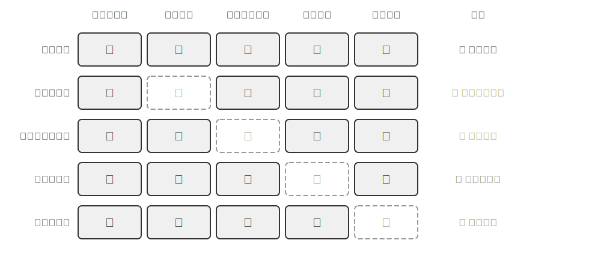
>
>
> 
>
> #### 观察结果
>
> 与基线组相比，可以观察到不同实验组的明显差异：
>
> - 移除工具定义后，Agent 不再调用任何工具；
> - 移除工具执行结果后，Agent 会反复执行相同操作，甚至无法结束任务；
> - 移除历史消息后，Agent 经常重复已经完成的步骤。
>
> “移除思考过程”一组的情况有所不同：如前所述，这项消融只能在自建系统上进行，此处给出的是理论预期——移除思考过程后，Agent 更容易出现前后不一致的决策。
>
> #### 思考
>
> 这些现象说明了什么？
>
> 为什么看不到工具定义时，Agent 不知道该做什么？
>
> 为什么看不到工具执行结果时，Agent 会不断重复操作？
>
> 为什么失去历史消息后，Agent 仿佛“忘记”了自己已经完成的工作？
>
> #### 实验结论
>
> Agent 的能力不仅来自模型本身，也来自它能够看到的信息。
>
> 上下文决定了 Agent 能看到什么，而 Agent 只能基于它看到的信息做决策。缺失不同的上下文信息，Agent 的行为会以不同方式退化。这正是上下文在 Agent 系统中不可替代的原因。

### ReAct 循环：三大组件如何协同

了解了 LLM、上下文和工具之后，一个自然的问题是：它们如何协同工作？

答案就是 ReAct 循环。

ReAct[^ch1-1] 来自 Reasoning + Acting，即“思考 + 行动”。虽然名字中只出现了思考和行动，但完整过程通常包含三个环节：模型先思考当前应该做什么，然后调用工具执行行动，再观察工具返回的结果，并据此决定下一步。

也就是说，Agent 的基本执行模式是：

> 想 → 做 → 看 

这个循环不断重复，直到任务完成。

值得说明的是，ReAct 原论文（2022）提出的是一种纯文本提示范式：Thought、Action、Observation 都由提示模板驱动，模型以生成文本的方式“扮演”这个循环。现代 Agent 则已演进为由原生工具调用驱动的循环——如前文“模型即 Agent”所述，工具调用能力被直接训练进了模型——但“思考 → 行动 → 观察”的循环结构一脉相承。

#### 轨迹：Agent 执行过程中的消息历史

为了理解 ReAct 循环，需要先理解一个重要概念：轨迹（Trajectory）。

轨迹是 Agent 在执行任务过程中不断积累的消息历史，包括用户消息、模型回复、工具调用和工具执行结果。每一次调用 LLM 时，它接收的完整上下文都由两部分组成：

> 上下文 = 静态前缀 + 轨迹

其中，静态前缀包括系统提示词和工具定义；轨迹则包括执行过程中不断增长的动态消息历史。

具体来说：

- 静态前缀：系统提示词 + 工具定义；
- 轨迹：用户消息 + 模型回复 + 工具调用 + 工具执行结果。

每次 LLM 生成新的响应后，这个响应又会追加到轨迹中，供下一次调用使用。

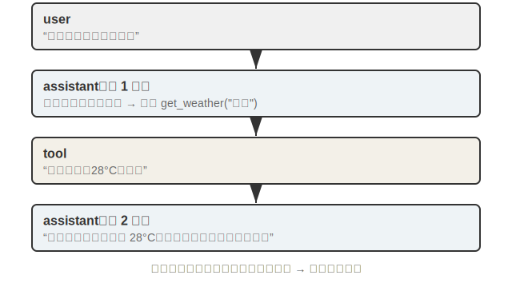

下面通过一个简单的天气查询例子来理解轨迹的结构（如图1-2所示）。

```python
轨迹 = [

  # 用户发起请求
  {
    "role": "user",
    "content": "北京今天天气怎么样？"
  },

  # 第一次迭代：模型决定查询实时天气
  {
    "role": "assistant",
    "reasoning": "需要先获取北京当前天气信息。",
    "content": "",
    "tool_calls": [
      {
        "name": "get_weather",
        "args": {
          "city": "北京"
        }
      }
    ]
  },

  # Agent 框架执行工具，并将结果加入轨迹
  {
    "role": "tool",
    "content": "北京：晴，28°C，微风"
  },

  # 第二次迭代：模型基于工具结果生成答案
  {
    "role": "assistant",
    "reasoning": "已获得天气信息，可以回复用户。",
    "content": "北京今天晴，气温约 28°C，伴有微风，适合户外活动。"
  }

]
```

注意，轨迹中没有显示系统提示词和工具定义。它们作为静态前缀，在每次调用 LLM 时都会自动拼接到轨迹前面。

另外需要说明的是，这个示例是概念示意，其中的 `reasoning` 字段展示了思考过程在轨迹中的逻辑位置。实际上，各厂商 API 对思考过程的保留策略并不相同：OpenAI 的 Chat Completions API 不返回思考内容；Anthropic 的 API 默认会丢弃历史轮次的 thinking 内容；DeepSeek 则明确要求调用方不要把 `reasoning_content` 回传到下一轮请求中。因此，“历史思考过程持久保留在轨迹中”并不是普遍行为——在多数商用 API 中，思考过程只在生成当前回复时起作用，不会成为后续轮次可见的上下文。

在这个例子中，Agent 只进行了两轮迭代：第 1 轮，它判断需要实时天气信息，于是调用天气查询工具；第 2 轮，它根据工具返回结果生成最终答案。虽然任务很简单，但已经完整展示了 Agent 的基本工作方式：先判断需要什么信息，再调用工具获取信息，最后根据结果完成任务。

这种设计的关键在于轨迹的累积性。每次调用 LLM 时，它都能看到当前完整的轨迹，因此知道用户提出了什么问题、自己之前做了什么、工具返回了什么结果。Agent 正是通过轨迹保持对任务状态的持续认知。

轨迹也让系统更容易解释和调试。用户消息、模型回复、工具调用和工具执行结果都被结构化地记录下来，开发者可以回溯整个执行过程，判断 Agent 为什么这样决策、在哪一步出现问题。

天气查询只是一个简单例子。在更复杂的任务中，Agent 可能会经历更多轮思考、工具调用和结果观察，轨迹也会随之不断增长。但无论任务复杂还是简单，底层机制都是相同的：

> Agent 基于当前轨迹进行思考，并将新的决策和结果不断追加到轨迹中。

理解了 Agent 如何通过轨迹完成任务后，我们再通过两个实验，观察不同模型是如何驱动 ReAct 循环的。

> ### 实验 1-2 ★：观察搜索型 Agent 如何自主使用工具
>
> 前面我们介绍了 ReAct 循环：想 → 做 → 看 。下面通过一个简单实验，观察搜索型 Agent 如何自主使用工具。任一支持联网搜索模式的对话产品都可以用来做这个实验（写作时，Kimi 是一个代表性产品，其背后的模型是 K2）。
>
> #### 实验步骤
>
> 打开一个支持联网搜索的对话产品（如 Kimi），开启联网搜索，输入：
>
> > 帮我比较 NVIDIA、AMD 和 Intel 最近一个季度的数据中心业务收入，并告诉我哪家公司增长最快。
>
> 发送后，不要急着阅读最终答案，而是先观察模型的执行过程。
>
> #### 观察现象
>
> 在执行过程中，你可能会看到：
>
> - 模型自动发起搜索；
> - 搜索一次后发现信息不足，继续搜索其他公司的数据；
> - 获得足够信息后停止搜索，并开始生成答案。
>
> 整个过程中，你并没有告诉模型应该搜索什么、搜索几次，它会根据任务需要决定下一步行动。
>
> #### 思考
>
> 回顾模型的执行过程：
>
> - 搜索前，它在判断完成任务需要哪些信息；
> - 搜索时，它在调用工具获取信息；
> - 搜索后，它会根据结果判断是否继续搜索，或开始生成答案。
>
> 这正是 ReAct 循环的体现：想 → 做 → 看。

> ### 实验 1-3 ★：体验 Deep Research 研究流程
>
> 前面的实验观察了 Agent 如何自主使用工具。下面再来看复杂研究任务中的 ReAct 循环。任一支持深度研究（Deep Research）模式的对话产品都可以用来做这个实验（写作时，ChatGPT 的 Deep Research 功能是一个代表）。
>
> #### 实验步骤
>
> 打开对话产品的深度研究模式，输入：
>
> > 帮我研究一下新能源汽车市场的发展趋势，并给出未来三年的主要机会和挑战。
>
> 观察模型从接到任务到生成最终报告的全过程。
>
> #### 观察现象
>
> 你可能会发现：
>
> - 模型不会立刻开始研究，而是先询问一些澄清问题；
> - 在开始研究后，会自动搜索多个信息来源；
> - 阅读部分资料后，又会继续搜索新的信息；
> - 最终将搜索结果整合为一份研究报告。
>
> #### 思考
>
> 回顾整个过程，你会发现，模型并不是简单地搜索一次然后输出答案，而是在不断重复：搜索 → 阅读 → 分析 → 再搜索。
>
> 同时，在真正开始研究之前，它还会先确认用户的研究目标和需求范围。
>
> 这说明 Agent 的工作方式不是一次性完成任务，而是在执行过程中不断规划、获取信息和调整策略。Deep Research 本质上就是多轮 ReAct 循环在复杂研究任务中的体现。

这两个实验中，模型都自主完成了“想 → 做 → 看”的多轮循环，无需你指定搜索几次、何时停止。图1-3 以一个数据分析任务为例，把这种由原生工具调用驱动的 ReAct 循环画了出来：模型自主决定何时调用搜索、何时调用代码解释器，整个流程无需外部编排代码——这正是前文“模型即 Agent”所说的、把工具调用能力训练进模型的结果。

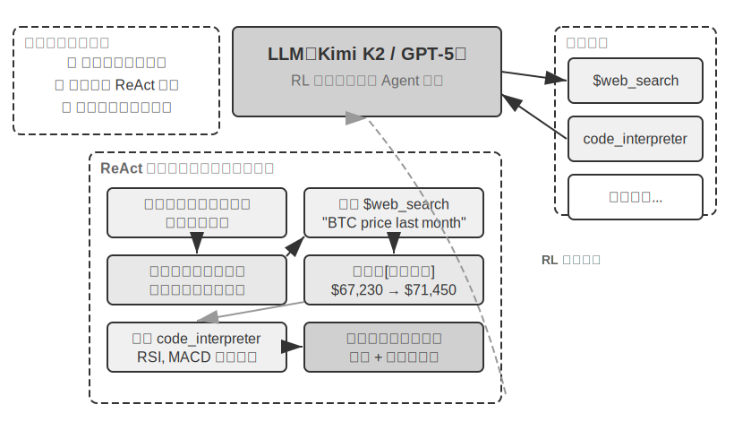

### Agent 的三种学习范式

看清了三个要素（LLM、上下文、工具）以及它们在 ReAct 循环中如何协同之后，还剩最后一个维度没有交代：**时间**。上面描述的是 Agent 跑完一轮的机制，而 Agent 的能力并非一成不变——它会随着一次次运行不断积累。从工程实践的角度看，Agent 主要通过三种范式获得和积累能力，它们分别落在模型参数、上下文和外部载体（知识库、工具代码等）上，如图1-4所示。

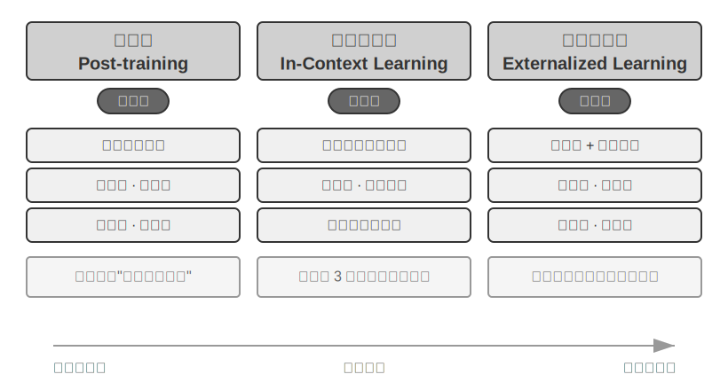

**第一种是后训练（Post-training）：把经验写进模型参数。**

通过监督微调（SFT）或强化学习，将行为模式直接固化到模型权重中。例如，用几千条标注好的医疗问诊对话对通用模型做领域 SFT，模型就能稳定掌握问诊的流程、话术和边界——这种能力不依赖提示词，在任何会话中都会自然表现出来。这种范式通用性最强、效果最稳定，但训练成本最高，更新周期以周计。

**第二种是上下文学习（In-context Learning）：在推理时通过上下文快速适应。**

模型不更新任何参数，只根据上下文中的信息调整行为。最典型的形式是少样本（few-shot）示例：在提示词中给出几条“用户投诉 → 标准回复”的客服案例，模型就能按照相似模式处理新的请求。工具反馈也是一种上下文学习：Agent 调用工具报错后，能在同一会话中根据错误信息改正参数、换一种做法。这种范式灵活、成本低、立即生效，但效果只存在于当前会话中，会话结束即消失。

**第三种是外部化学习（Externalized Learning）：把经验沉淀到模型之外。**

将知识和流程保存到知识库、工作流、Skill（可复用的技能模块，把一段操作流程打包成 Agent 可按需加载的单元）或工具代码中，供后续任务按需加载。例如，Agent 在一次部署任务中踩过“先迁移数据库再重启服务”的坑，可以把这条经验写入知识库或固化为一个部署 Skill；下次执行同类任务时加载它，就不会重蹈覆辙。这种范式具有持久性和可解释性，也更容易维护和复用。

三种范式分别对应不同的时间尺度：

- 后训练提供长期能力；
- 上下文学习提供即时适应；
- 外部化学习提供持久积累。

三者相互配合，共同构成现代 Agent 的学习体系。第七章将深入后训练，第八章将深入外部化学习，并进一步展开三种范式之间的关系。

## Harness 工程：模型之外的竞争力

到这里，我们已经理解了 Agent 的基本工作原理：LLM 通过 ReAct 循环，在上下文的辅助下调用工具、根据工具返回的结果持续推进任务，并通过三种学习范式不断积累能力。

这套机制可以让 Agent 跑起来，但还不足以让它稳定地进入生产环境。模型可能会编造不存在的工具或参数，可能选错工具，也可能在执行失败后无法恢复。一个能跑通的 Demo，和一个可以长期运行的产品之间，还有很长一段工程距离。

这正是 Harness 工程要解决的问题。

本章前半部分回答了“Agent 是什么”；接下来，我们从工程视角进一步回答：Agent 如何从 Demo 走向生产环境。

### 什么是 Harness 工程

前面几节建立了 Agent 的核心公式：

> Agent = LLM + 上下文 + 工具

这个公式描述的是 Agent 的能力组成：LLM 负责理解与思考，上下文提供任务信息，工具负责与外部世界交互。

从工程实现的角度看，我们还可以换一个视角：

> Agent = 模型（Model） + Harness

其中，模型指具备思考和工具调用能力的模型；Harness 则是围绕模型构建的工程基础设施。

如果说模型负责“想”，那么 Harness 负责让模型在真实系统中“看得见、做得动、可约束、可验证、可恢复”。

Harness 可以拆成五个部分，如表1-3所示。

**表 1-3 Harness 工程的五个组成部分**

| 组成部分           | 作用                 | 类型     |
| ------------------ | -------------------- | -------- |
| 上下文（Context）  | 为模型提供感知信息   | 核心能力 |
| 工具（Tools）      | 为模型提供行动手段   | 核心能力 |
| 约束（Constraint） | 设定行为边界         | 保障机制 |
| 验证（Verify）     | 检查执行结果是否正确 | 保障机制 |
| 纠正（Correct）    | 发现问题后恢复执行   | 保障机制 |

其中，上下文和工具让 Agent 具备完成任务的能力；约束、验证和纠正则让这种能力能够安全、稳定地落地。

对照本章开头的公式可以看出，“Agent = 模型 + Harness”与“Agent = LLM + 上下文 + 工具”是同一对象的两种分解：Harness 中的上下文与工具组件，正是前一个公式三大支柱中的其中两个；Harness 在此之外还包含约束、验证、纠正这些工程保障机制。

以退款 Agent 为例。用户要求退掉 3 天前的订单，Agent 不仅要知道退款规则、调用退款接口，还要防止金额出错、确认退款成功，并处理接口异常。

在这个过程中：

- 退款规则属于上下文；
- `query_order` 和 `process_refund` 属于工具；
- 金额校验属于约束；
- 状态确认属于验证；
- 自动重试属于纠正。

模型负责思考，Harness 负责保障执行。

其中的验证环节值得多说一句：如何把“检查执行结果是否正确”做得系统化，如何科学地评估一个 Agent 的能力，是第六章（Agent 的评估）的主题。

同样一个模型，在缺少 Harness 时，可能会编造退款结果、调用错误接口，或者在接口超时后直接失败；而在 Harness 的保护下，Agent 才能按照规则完成操作，并在异常发生时恢复执行。

随着 Agent 从 Demo 走向生产环境，工程实践的重点也会发生变化：早期重点是“让 Agent 能做事”，生产环境的重点则是“让 Agent 可靠地做事”。

以 Coding Agent 为例，文件读写、命令执行和代码搜索等工具本身只是基础能力。真正的工程复杂度往往来自围绕这些工具建立的保障机制，例如：

- 流程状态管理：追踪任务执行到哪一步；
- 上下文压缩：在上下文过长时保留关键信息；
- 权限管理：决定哪些操作需要用户确认；
- 熔断机制（Circuit Breaker）：连续失败时自动停止执行，防止错误扩大；
- 错误恢复：在异常发生后重试、回滚或交还给人类。

这也是 Harness 工程的核心价值：它不是替代模型，而是让模型能力变得可控、可靠、可持续。

回到 harness 这个单词本身的意思（马具）的隐喻：模型像一匹能力强大的马，而 Harness 则是缰绳、马鞍和护具。模型决定能力上限，Harness 决定这些能力能否安全、可靠地落地。

设计和优化这套模型之外的基础设施，就是 Harness 工程（Harness Engineering）。

### 从提示工程到 Harness 工程

AI 应用工程的发展，可以理解为工程师关注范围不断外扩的过程。

最早是软件工程（Software Engineering）：关注系统设计、架构、测试、部署和运维。

大模型出现后，提示工程（Prompt Engineering）成为第一波创新。开发者发现，通过设计更好的提示词，可以显著改善模型输出。

随后，人们进一步意识到：模型表现不只取决于提示词，还取决于它能看到什么信息。于是，上下文工程（Context Engineering）开始成为重点。它关注如何系统管理系统指令、工具定义、对话历史、外部知识和用户记忆，让模型在每次决策时拥有更合适的上下文。

而 Harness 工程将视野继续向外扩展。

它关注的不只是“模型能看到什么”，而是“模型运行在什么样的系统中”。这包括上下文管理、工具接口、权限控制、验证机制、反馈循环和错误恢复等模型之外的全部基础设施。

这几种工程范式不是替代关系，而是层层扩展：

> 软件工程 → 提示工程 → 上下文工程 → Harness 工程

每向外扩展一层，工程师能影响的范围就更大：

- 提示工程关注单次模型调用；
- 上下文工程关注模型看到的信息；
- Harness 工程关注整个 Agent 系统的运行过程。

当模型能力逐渐接近，不再是唯一决定性因素时，竞争优势就会转移到模型之外的工程实践。

在很多 Agent 实践中，系统性能的提升并不来自更换模型，而来自更好的执行策略、自动检查机制、循环检测机制和错误恢复设计。换句话说，决定 Agent 表现的，不只是模型有多强，也包括模型之外的工程系统是否做对了。

因此，Harness 工程的价值不在于替代模型，而在于让模型能力稳定、可控、可持续地发挥出来。

## 构建 Agent 的关键问题

理解 Harness 工程之后，关键不是记住五个组成部分，而是回到实际构建：一个 Agent 系统要真正落地，需要在模型、上下文、工具、编排和安全之间做一系列设计取舍。本节将围绕这些取舍，梳理构建 Agent 时必须回答的几个关键问题：

- 如何让 Agent 尽量简单、透明、可调试；
- 如何选择合适的模型；
- 如何设计上下文和工具（工具设计已在 1.1 节展开，上下文设计是第二章的主题，本节不再单列）；
- 如何在工作流与自主 Agent 之间做取舍；
- 如何选择合适的框架或平台；
- 如何通过护栏和人工干预控制风险。

这些问题共同决定了一个 Agent 系统能否从实验走向生产。

### 设计原则

根据已有工程实践，成功的 Agent 系统通常遵循三个设计原则[^ch1-2]。

**第一，保持简单。**

从最简单的方案开始，只在确实必要时增加复杂度。直接的 API 调用优于过度封装的框架，清晰的代码优于聪明但难以调试的抽象。

Agent 系统本身就具有不确定性。每多一层抽象，就可能多一个未来排查问题时的盲区。

**第二，保持透明。**

Agent 的规划步骤、执行日志和决策轨迹应该尽可能可见。

透明性不仅便于调试，也有助于用户建立信任。黑箱中的错误一旦发生，外部观察者既难定位，也难纠正。

**第三，设计好工具接口。**

工具接口不仅要方便程序调用，更要方便 Agent 理解和使用。这类面向 Agent 的接口设计，也被称为 Agent-Computer Interface，简称 ACI[^ch1-3]。

好的工具接口应该命名直观、参数清楚、边界明确，并尽量从设计上减少误用。工具设计不清晰，再强的模型也会频繁出错，因为模型与外部世界之间唯一的沟通通道就是工具接口。1.1 节的工具设计强调工具应尽量通用，这里则从接口质量（ACI）的角度补充，两者互补。

### 模型选型

模型是 Agent 的智能基座。选对模型，往往比单纯优化提示词更重要。由于模型迭代极快，本节不推荐具体版本，而是给出几个相对稳定的选型维度：

- **思考与工具调用能力**：多数 Agent 都需要多步思考、工具选择和动态决策，这是最基础的要求；只有少数单步任务或固定界面操作，可以使用能力较轻的模型。
- **上下文能力**：决定 Agent 能否胜任长任务、多轮任务和复杂资料处理；但上下文窗口越长并不意味着系统一定越可靠，还需要配合压缩、检索和状态管理（详见第二章）。
- **输出速度**：Agent 通常需要多轮模型调用，每一轮慢几秒，叠加到整个任务中就会明显影响用户体验。
- **多模态能力**：如果 Agent 需要理解图片、音频、视频或屏幕界面，这就是硬性要求，且不同模型差异很大；语音对话、GUI 操作、机器人等实时多模态交互场景对模型和架构还有特殊要求，详见第九章。
- **成本、部署与合规**：闭源模型通常能力强、生态成熟，但成本较高，也受限于厂商 API 策略；开源模型成本更低，可私有化部署，也支持微调定制，适合对成本、数据安全或合规有要求的场景。

核心原则只有一条：在自己的真实任务上评估，而不是只看通用排行榜。不同模型在上述维度上的表现差异明显，排行榜名次未必反映模型在你的具体任务上的表现。系统的模型选型与评估方法详见第六章。

### 编排模式：工作流与自主 Agent

模型、上下文和工具准备好之后，还要决定它们如何被组织起来。

这就是编排模式要解决的问题：上下文如何在多次 LLM 调用之间流动，工具如何被调度，Agent 的执行路径是预先设定，还是根据环境反馈动态生成。

构建 LLM 应用时，应遵循“从简单到复杂”的原则[^ch1-2]：

- 如果单次 LLM 调用能解决问题，就不要引入 Agent；
- 如果任务可以拆成固定步骤，就优先使用工作流；
- 只有当任务需要动态决策和灵活路径时，再使用自主 Agent。

Agent 系统通常会用更高的延迟和成本换取更强的任务完成能力，因此必须判断这种交换是否值得。

#### 工作流模式：确定性的编排

工作流（Workflow）是通过预定义路径编排 LLM 和工具的系统。它的执行顺序由开发者提前设计，LLM 只在每个节点内部负责理解和生成。

以订机票为例，一个工作流可以包含四个固定节点：

1. 核实用户身份；
2. 搜索可用航班；
3. 完成付款；
4. 确认预订。

每个节点内部可以使用 LLM，例如理解用户的出行需求；但节点之间的流转顺序由代码控制。系统不会在付款前确认预订，也不会在身份核实前开始支付。

工作流的优势是可控和安全。开发者可以确保关键步骤不被跳过，业务规则不依赖模型自由判断。它适合流程明确、合规要求高、错误成本高的场景。

它的局限也很明显：缺乏变通性。如果用户在付款环节临时改签，或者航班取消需要重新推荐方案，固定流程往往只能进入预设异常分支，或将控制权交还给人类。

#### 常见的工作流模式

工作流不是只有“一条直线走到底”这一种形态。Anthropic 在《Building Effective Agents》[^ch1-2]中总结了五种反复出现的工作流模式，它们都用确定性的代码来编排 LLM 调用，区别在于**信息如何在多次调用之间流动**。理解这五种模式，能帮你在“该不该上自主 Agent”之前，先用更简单、更可控的结构解决大部分问题。

**提示链（Prompt Chaining）**把一个复杂任务拆成若干个顺序步骤，每一步的输出作为下一步的输入（图1-5）。例如“需求文档 → 生成大纲 → 撰写正文 → 翻译成多语言”，每一步只让模型专注做好一件事，准确率比让模型一步到位更高。步骤之间还可以插入**门控**（gate）做程序化检查——比如大纲不足五节就打回重写——把错误挡在传播到下游之前。它适合能被清晰拆解为固定子步骤的任务。

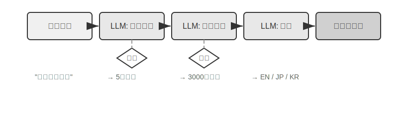

**路由（Routing）**先用一个分类器判断输入属于哪一类，再把它分发给专门的后续处理（图1-6）。例如客服系统把用户查询分成退款、技术支持、常见问题等类别，各自使用不同的提示词和工具。路由的价值在于**关注点分离**：每条分支的提示词可以单独优化而互不干扰，还能把简单、高频的问题路由到更便宜的小模型，把算力留给真正困难的请求。分类既可以由 LLM 完成，也可以用传统分类器。

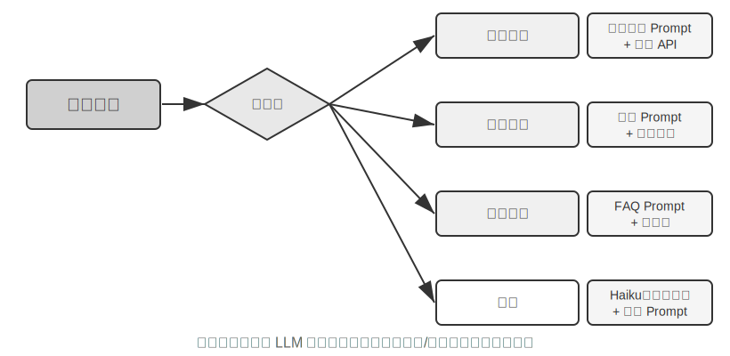

**并行化（Parallelization）**把任务同时分给多个 LLM，再汇总结果（图1-7）。它有两种典型形态：一是**分段**，把大任务切成互不依赖的子任务并行处理，例如让三个模型分别从安全、风格、逻辑三个视角审查同一段代码，再聚合成一份综合报告；二是**投票**，用多个模型（或同一模型多次采样）处理同一任务，通过多数表决提升可靠性。并行化既能降低延迟，也能让每个模型专注单一维度，避免“一个提示词塞进太多要求”导致的顾此失彼。

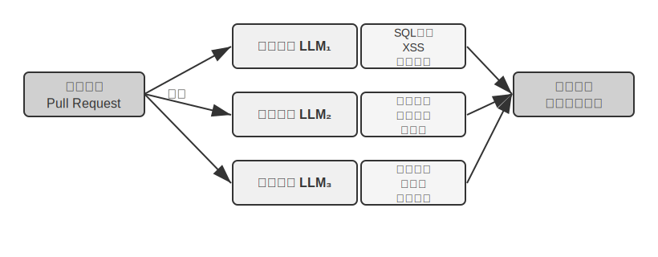

**编排器-工作器（Orchestrator-Workers）**由一个编排器 LLM 在运行时动态地把任务拆解成子任务、分配给多个工作器，再合并它们的产出（图1-8）。它与并行化的关键区别在于：子任务不是预先切好的，而是**由编排器根据具体输入临时决定**。例如修复一个跨多文件的代码 Issue，编排器先分析要改哪几个文件，再为每个文件派一个工作器，最后合并并验证一致性。这种模式适合子任务数量和边界无法提前确定的场景。

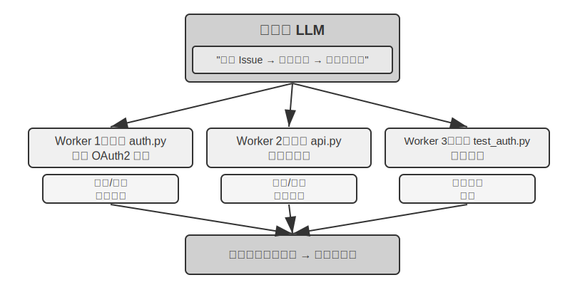

**评估器-优化器（Evaluator-Optimizer）**让一个生成器 LLM 产出结果，再由一个评估器 LLM 按多维标准打分并给出改进建议，两者反复迭代直到达标（图1-9）。例如文学翻译，生成器给出初稿，评估器从准确性、流畅性、文化适应等维度评分，指出“流畅性不足”，生成器据此改写，循环往复；退出条件通常是所有维度达标或达到最大轮次。这一模式的前提是**评估标准清晰、且反馈能真正指导改进**——本书后续反复出现的提议者-审核者（proposer-reviewer）范式，正是它的一个重要实例。

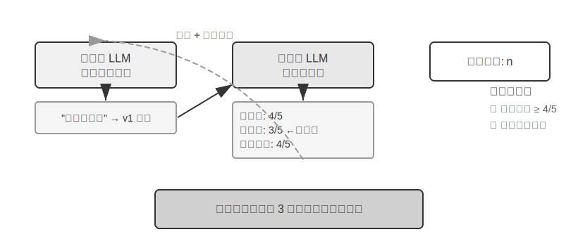

这五种模式并非互斥，实际系统常常组合使用——例如先路由、再对某条分支用提示链、其中一步再并行化。它们的共同点是：编排逻辑由开发者用代码写死，模型只在每个节点内部负责理解与生成。当任务的步骤和路径**无法预先确定**、必须由模型在执行中动态决策时，才需要下一节要讲的自主 Agent。

#### 自主 Agent：动态自主决策

当固定路径无法覆盖任务变化时，就需要自主 Agent（Autonomous Agent）。

自主 Agent 与工作流的核心区别在于：执行路径不是预先定义的，而是由 Agent 根据环境反馈实时决定。

仍以订机票为例。用户说“帮我订下周三去上海的机票”，自主 Agent 可能会先搜索航班，发现需要登录，于是先核实身份；回来继续搜索后，发现最便宜的航班需要转机，于是询问用户是否接受；用户拒绝后，它再调整搜索条件。

这意味着自主 Agent 需要持续规划、执行、观察和调整。它不是按固定流程往下走，而是在循环中不断根据反馈决定下一步。

从实现角度看，自主 Agent 本质上就是一个在循环中调用工具的 LLM。这正是前面介绍的 ReAct 循环。常见的退出条件包括：

- 模型生成最终答案；
- 调用最终输出工具；
- 遇到不可恢复的错误；
- 达到最大轮次数；
- 触发人工干预。

自主 Agent 适合开放式任务，例如代码修复、计算机使用、资料研究和复杂问题求解。这类任务往往难以提前预测完整步骤，只能让 Agent 在执行中动态探索。

但自主性也会带来更高的成本和风险。Agent 可能陷入循环，可能放大中间错误，也可能执行超出预期的操作。因此，部署自主 Agent 时必须配合沙盒（隔离的运行环境，把 Agent 的操作限制在安全范围内）、权限控制、监控、护栏和必要的人机协作。

自主 Agent 的执行循环如图1-10所示。它不是沿着固定节点前进，而是在每一轮根据当前轨迹、工具反馈和停止条件决定下一步行动。

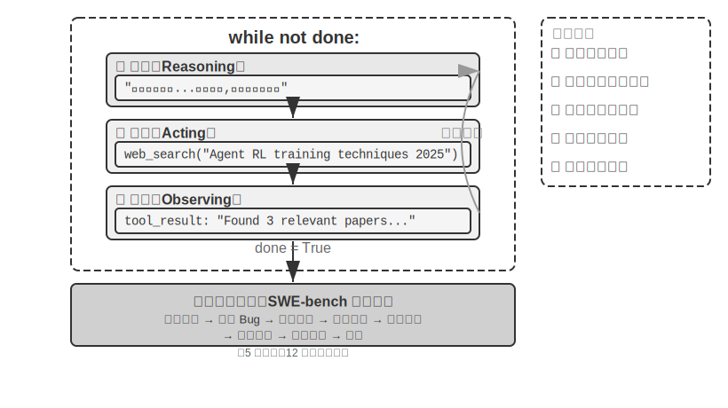

#### 两种模式的选择与混合

工作流和自主 Agent 并不是非此即彼。

很多生产系统会混合使用两种模式：高风险、强合规、步骤明确的部分使用工作流；需要灵活判断、开放探索的部分交给自主 Agent。

例如，一个订票系统可以用工作流处理身份核验、支付和确认预订，用自主 Agent 处理复杂偏好理解、航班比较和异常情况沟通。

这也是实际工程中更常见的形态：用确定性流程保证底线，用自主 Agent 提供灵活性。

图1-11 展示了 n8n（一款可视化工作流自动化平台）的工作流编辑界面。它代表了一类常见的混合式开发方式：开发者可以用可视化流程固定关键步骤，也可以在部分节点中接入 LLM 或 Agent，让系统在受控边界内处理更开放的任务。

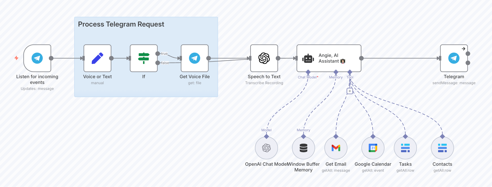

编排还有一个自然的延伸方向。当单个 Agent 的上下文窗口和能力不足以承载整个任务时，可以让多个 Agent 分工协作：有的负责规划，有的负责执行，有的负责审查。多 Agent 系统按上下文是否共享、协作拓扑如何组织，可以分为多种架构，各有适用场景和代价。这是第十章的主题。

### 框架选择：少关注名气，多关注适配度

在实际开发中，工程师通常会借助框架或平台构建 Agent。常见选择大致包括几类：代码优先的 Agent SDK，偏状态编排的工作流框架，低代码平台，多 Agent 编排框架，以及面向个人助理或自动化场景的 Agent 平台。

框架本身不是目的。选择框架时，真正需要关注的是它能否支持你的系统需求：

- 是否方便管理上下文和状态；
- 是否方便接入和治理工具；
- 是否支持权限控制、错误恢复和可观测性；
- 是否适合团队的开发方式；
- 是否会引入过重的抽象，增加调试难度。

随着“模型即 Agent”趋势的发展，框架的价值不再只是编排 LLM 调用。模型越来越能自主决策，但上下文管理、工具生态、安全约束、错误恢复和可观测性仍然需要工程系统来支撑。

因此，选择框架时，关键不在于框架是否复杂或流行，而在于它能否用最小的抽象帮助你专注于业务逻辑。

### 护栏与安全性

前面讨论的编排模式解决了“如何做事”的问题。但生产级 Agent 还必须回答另一个问题：如何确保它做得对、做得安全。

护栏（Guardrails）是 Harness 中约束、验证与纠正机制的重要实现方式。它们构成了保障 Agent 行为安全可控的分层防线。

本章只做高层概览。具体实现将在第二章、第四章和第五章分别展开。

从部署位置看，护栏通常分为三类。

- **第一，输入侧护栏。**

  输入侧护栏在请求到达 Agent 前进行拦截，用于识别偏离任务范围的请求、有害输入、越狱尝试和提示注入。

  越狱（Jailbreak）通常指用户直接诱导模型绕过安全限制；提示注入（Prompt Injection）则常通过网页、文档等外部数据间接操纵模型行为。二者都可能让 Agent 偏离原有指令，因此需要重点防护。

- **第二，执行侧护栏。**

  执行侧护栏发生在工具调用时，重点是权限控制和风险评级。

  不同工具的风险并不相同：查询天气通常是低风险，发送邮件属于中风险，转账、删除文件、取消订单等则属于高风险。高风险操作应要求额外确认，必要时交由人类审批。

- **第三，输出侧护栏。**

  输出侧护栏发生在结果返回用户前，用于检查事实错误、格式问题、品牌风险和敏感信息泄露等问题。

单个护栏很难提供足够保护。更可靠的方式，是在输入、执行和输出三个位置设置分层防线。

护栏不是上线前临时补丁，而是 Agent 架构的一部分。越早纳入设计，系统越容易控制风险。

#### 人工干预

人工干预（Human in the Loop，又称“人在回路”）是另一种关键保护机制。

它允许 Agent 在不确定、失败或高风险场景中，把控制权交还给人类。这在系统部署早期尤其重要，因为它可以帮助团队识别失败模式、发现边缘情况，并逐步建立评估和改进机制。

通常有两类情况需要触发人工干预。

第一类是超过失败阈值。例如，Agent 多次重试后仍无法理解用户意图，或连续调用工具失败，就应该停止自动执行，转交人类处理。

第二类是高风险操作。例如取消订单、授权退款、发送敏感信息、执行不可逆操作等，都应在系统足够可靠之前加入人工确认。

人工干预不是 Agent 能力不足的表现，而是生产系统可靠性的组成部分。一个成熟的 Agent 系统，不仅要知道什么时候继续执行，也要知道什么时候停下来，请人接管。

## 本章小结

本章从实践出发，建立了理解 AI Agent 的基础框架。

现代 Agent 可以用一个公式概括：

> Agent = LLM + 上下文 + 工具

LLM 负责理解、规划和决策；上下文决定 Agent 能看到什么；工具决定 Agent 能做什么。三者协同，才构成一个能够执行任务的 Agent。

Agent 的运行方式不是一次性生成答案，而是在 ReAct 循环中不断推进任务：先思考，再行动，再观察结果，并根据反馈继续调整。这个“想 → 做 → 看”的循环，是 Agent 处理多步骤任务的基础。

但一个能跑通的 Agent Demo，并不等于一个可靠的产品。进入生产环境后，关键问题会从“能不能做事”转向“能不能可靠地做事”。这正是 Harness 工程关注的内容：通过上下文管理、工具接口、约束、验证、纠正、护栏和人工干预，让模型能力安全、稳定地落地。

因此，构建 Agent 不是单纯选择一个更强的模型，而是围绕模型设计一套完整的工程系统。下一章将从其中最核心的一环开始：上下文工程。

[^ch1-1]: Yao, Shunyu et al., “ReAct: Synergizing Reasoning and Acting in Language Models” , 2022. arXiv:2210.03629.
[^ch1-2]: Anthropic, “Building Effective Agents” , 2024.
[^ch1-3]: Yang, John et al., “SWE-agent: Agent-Computer Interfaces Enable Automated Software Engineering” , 2024.

## 思考题

1. ★★ 如果你只能给一个 Agent 系统增加一项能力——更强的模型、更丰富的上下文、还是更多的工具——你会选哪个？在什么条件下你的选择会改变？
2. ★★★ ReAct 循环中，Agent 的每一次 LLM 调用都会看到完整的历史轨迹。随着轨迹增长，这种设计的成本是二次方增长的。有没有办法在不丢失关键信息的前提下打破这个二次方？
3. ★★ “模型即 Agent” 范式意味着模型在工具调用决策上越来越自主。但本章论证了 Harness 工程的重要性反而在增加。这两个趋势如何共存？Agent 框架未来的核心价值体现在哪些方面？
4. ★★ 消融实验中 “工具结果反馈” 的缺失导致 Agent 陷入无限循环。在生产环境中，除了工具结果缺失，还有哪些情况可能导致 Agent 循环？你会设计怎样的检测和终止机制？
5. ★★ 如果你要设计一个专门处理航班订票的客服系统，你会选择工作流模式还是自主 Agent 模式？有没有可能在同一个系统中混合使用两种模式？
6. ★★★ 护栏部分提到了工具风险评级。如果一个工具在大多数情况下是低风险的，但在特定参数组合下变为高风险（如 `delete_file` 删除普通文件 vs 删除系统文件），你会如何设计动态风险评估？
7. ★★ 本章的 Agent 产品表格中，所有 Agent 的动作空间都是 “开放式” 的。一个受限的动作空间（比如只能从预定义选项中选择）在什么场景下反而优于开放式？
8. ★★★ 好的 Agent 设计原则应当尽量穿越模型的迭代周期而长期有效。试举一个你认为可能会随模型进步而过时的当前 Agent 设计原则，并说明理由。
